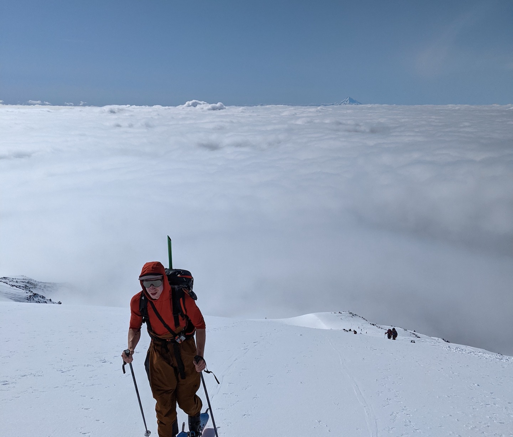

# Snoqualmie Crust Calculator

## Intro
> **When we see temperature inversions with a layer of low relative humidity above them, it often indicates a band of low-elevation clouds with clearer skies above them.**

This repo aims to provide utilities that aid in ingesting weather station data from the snoqualmie pass region of Washington state in order to produce some kind of meaningful insight into skiing conditions. 

The main focus of this code at the time of writing is to correctly recognize temperature inversions and cloud breaks (based on relative humidity) in order to predict the presence of sun crusts at provided elevation bands.

Nothing beats actually checking out conditions for yourself, but hopefully this tool can serve as an additional data point for trip planning.

## What assumptions are made?
Snow & weather conditions are determined by thousands of ever-changing variables. It's impossible to boil weather data down into simple yes/no answers without cutting some corners. We assume:
* If temperature increases with elevation, this indicates an inversion
* A relative humidity of < 70% indicates a cloud break
* A sun crust can only form if temperatures are at or below freezing (I know, I know)
* Temperatures will drop below freezing after nightfall

## What isn't taken into account?
* Aspect
* Wind Chill
* Pre-existing snow conditions
* Early/late season conditions
* High elevation inversions
* Partial/localized sun breaks
* Mother nature's wrath

## Why just Snoqualmie?
I wrote this model specifically with Snoqualmie pass in mind because of a few factors:
* Inversions are frequent
* Temperatures are rarely well below freezing
* Relative humidity is usually high

I don't think the model used for determining sun crusts or cloud-breaks applies well in areas with low overall humidity or colder overall temperatures.

### Note:

> This code will likely upset you. You will probably not agree with all the assumptions I made in the calculations, because I don't even agree with them myself. These models should be taken with a comically large grain of salt.
